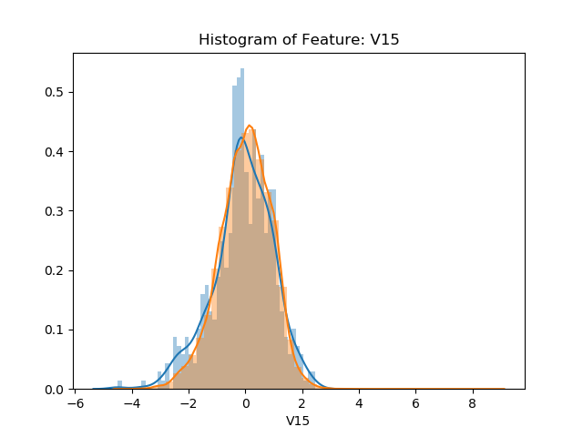
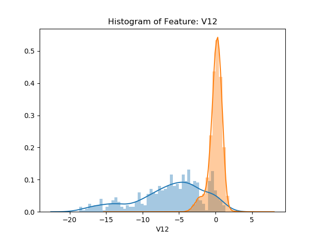
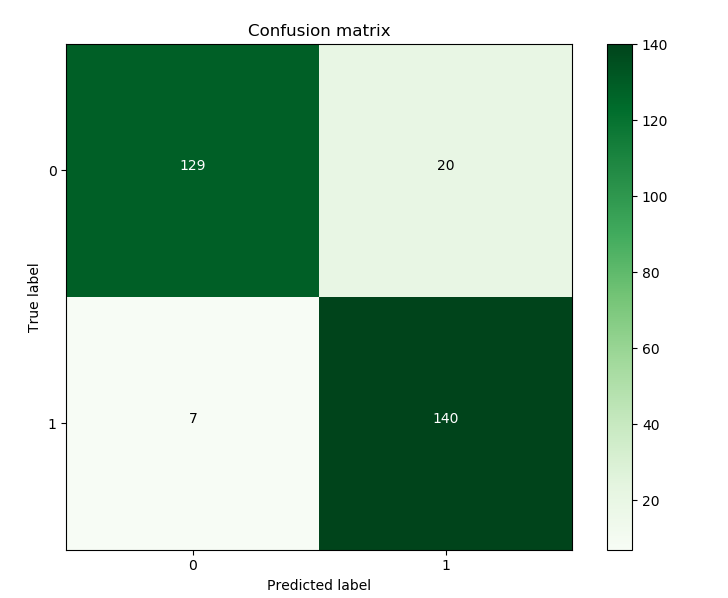
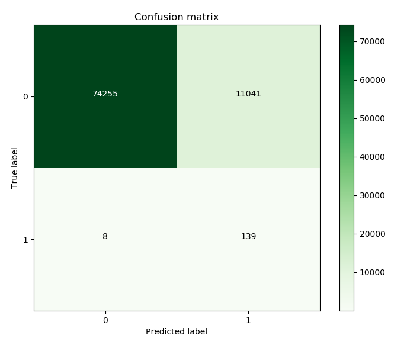

# Fraud Detection
This project is based on the analysis of a Kaggle dataset that is a conglomeration of instances with anonymous feature data and their corresponding classification of fraud or not fraud.  The intent of this project was to utilize machine learning in order to create a model that was able to most accurately predict fraud.

An important aspect of fraud detection, is to understand which metric you want to optimize in order to have a well performing model.  In many instances of fraud detection, it is important to ensure that the occurence of fraud is not missed.  This means that one would want to create a model that is more sensitive to classifying something as fraud, however, this increases the chances of classifying something as fraud even though it may not be the case.

# EDA
## Feature Engineering

Because features were anonymous, it was difficult to decide which features would be more or less important to look at intuitively.  The approach taken here, is to plot the distribution of fraud and not fraud instances on the same graph for each of the features.  The idea is that if the distribution of both fraud and not fraud instances are the same, we can deem that feature unimportant for our machine learning model that we will implement.  Shown below is an instance of a feature that would be deemed unimportant for classification purposes:

In the image below, we can see that there are significant differences in the distributions of fraud and not fraud instances.  This implies that there are differences in behavior that would be important to look at for classification.  Note how if we were to take a certain range of this feature (for example taking values less than -5 in this feature, V12) we can see that we are able to separate the different classes more effectively.  We can then engineer features that more easily distinguish fraud and not fraud groups in order to aid in our machine learning classification algorithm.

# Machine Learning Model
In this instance, a Logistic Regression model was utilized in order to predict an insance as being fraud or not fraud.  The important thing to note about this set of data, and most likely most other sets of data dealing with fraud, is the scarcity of fraud instances among the tens of thousands of normal transactions that have taken place.  The problem with training a model on the entire set of data, is that the algorithm will quickly come to find out that classifying all instances as not fraud will still gain a considerably high accuracy score.  Because of this, undersampling was utilized here to avoid these issues.

After training a model on the undersampled data, I was able to see how my model was able to perform among that subsample.

The classification model trained on the subgroup of data achieved a recall score of above 95% when predicting on the test subgroup.  Athough an excellent score was achieved on this subsample of data, below we can see the performance on a test of the entire dataset.

Here we see a recall score of ~94.6%.

